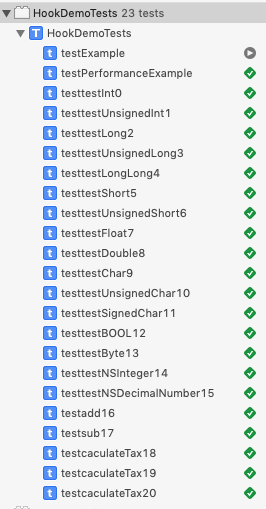

#### 工作目的

​	跟踪OC方法的调用，自动针对方法生成UnitTestCases单元测试用例，生成的Cases要能在Xcode的XCTest中跑通。

​	生成的case的作用之一是用于回归，验证比如qq在新版本中增加了代码，通过回归来验证原有功能是否被影响，能否得到往常的结果。

<br>

#### 工作支持

* logos    

  ​	iOS的hook工具，logos代码可用于iOS的runtime-hook（logos提供的 `logify.pl` 可帮助从 .h头文件中 生成该头文件中声明过的所有方法的原始的logos代码）。

* monkeyDev

  ​	iOS逆向开发框架之一，免越狱继承了logos及其他工具。本次项目的runtime-hook就是把工程项目build出的 `.app` 文件在 monkeyDev项目中做hook来获取runtime信息。

  <br>

#### 工作流程

  目前还是需要人工介入，介入内容全是简单的复制，将各步骤生成的代码放到对应地方；自动生成的代码是直接可用的，不需要人力参与代码实现或修改。

1. 使用python脚本配合`logify.pl`脚本，生成打tag的hook代码，该hook代码的功能是所有被选定的头文件内的方法在执行时会在控制台输出信息，信息包括该方法所属类、方法类型和方法名、参数列表、返回值类型和数值等（人工操作内容：指定待扫描头文件）；
2. 将该hook代码在monkeyDev的hook环境中真机运行，并使得被hook方法被调用；那么会打印被hook方法的信息，信息中包含了被调用方法所属的类，方法名，参数列表、返回值类型和具体数值等，将这些信息收集起来（人工操作内容：将生成的hook代码复制到moneyDev项目并运行，然后复制console输出到某一本地文本文件供下一步的脚步读取）；
3. 使用python脚本处理这些输出，获取到上述的方法runtime调用信息，然后按照XCTest的语法生成相应的测试case；因为已经获得了方法调用和返回值等信息，那么再次调用方法（传参不变），得到一个返回值，和原返回值进行比较；如果比较通过，那么证明方法运行无误；否则就有问题（人工操作内容：复制脚本生成的UnitTestCases代码到工程的测试文件内并运行）。

<br>

#### 工作成果展示

```objective-c
// 待hook方法的头文件，内有 TaxRevenueBL类，该类的caculateTax方法用于计算个人所得税，参数为double类型的revenue收入，返回double类型的应缴纳税额。
@interface TaxRevenueBL : NSObject
- (double) caculateTax:(double)revenue;
@end
  

// 生成的taged-runtime-hook-code，%log()中的参数会被打印出来，该参数带了调用该函数需要的静态信息，例如所属类，方法名，参数列表，返回值类型等
%hook TaxRevenueBL
- (double) caculateTax:(double)revenue { 
	double r = %orig;
	%log(@" = %.10lf", (double)r, @"【 (FromClass)TaxRevenueBL  (MethodType)InstanceMethod  (MethodName)caculateTax  (ArgsCount)1  (Arguments)[:(double)revenue ]  (ReturnType)(double)  (FromeFile)/Users/allen/workspace/ios/HookDemo/HookDemo/TaxRevenueBL/TaxRevenueBL.h  】", @"Method Called Tag!!");
	return r;
}
%end  
  

// 方法执行时被hook到后在 console 里的输出，传入参数为7800.000000，结果为84.000000；这部分运行时内容 + 后面跟随的静态调用信息可生成UnitTestCase
[m -[<TaxRevenueBL: 0x28238ce10> caculateTax:7800.000000]:  = %.10lf, 84.000000, 【 (FromClass)TaxRevenueBL  (MethodType)InstanceMethod  (MethodName)caculateTax  (ArgsCount)1  (Arguments)[:(double)revenue ]  (ReturnType)(double)  (FromeFile)/Users/allen/workspace/ios/HookDemo/HookDemo/TaxRevenueBL/TaxRevenueBL.h  】, Method Called Tag!!
 
 
 // 生成的XCTestCase代码，这里有2部分，都需要复制进Xcode原项目内。一个是UnitCase自身，一个是支持Case通过编译的方法声明部分。
 //方法声明部分，加了它才能过编译，方法体会在runtime时去原方法体那里找
 @interface TaxRevenueBL : NSObject
- (double) caculateTax :(double)revenue ;
@end
 // Case部分，执行和判断在这里
- (void)testcaculateTax18 {
	TaxRevenueBL* instance18 = [[TaxRevenueBL alloc] init];
	double result18 = [instance18 caculateTax:7800.000000];
  //不是直接比相等，而是把结果先转成小数点后6位的字符串，再从字符串生成double num，这样可以避免因为精度不匹配出现的case执行失败问题，类似的适配工作在一些其他的数据类型里也有表现
	double result18T = [[NSString stringWithFormat: @"%.6f", result18] doubleValue];
	XCTAssertEqual(result18T, 84.000000, @"Case18 passed!");
}
```

多个方法在XCTest中执行通过，结果如预期：



<br>

#### 工作进展

1. <font color="red">方法返回值为 void 类型的方法</font>，目前无法有效的通过返回值进行执行成功与否的监控，根据方法体来判断是否成功执行目前不具备可行性，因此只支持对返回值非空的方法生成UnitTestCases

2. <font color="red">方法返回值较复杂的</font>，例如返回 NSObject 的方法，对象太复杂，难以做到通配，且上述解决思路在面对复杂对象时也不能通配，因此也未兼顾到，只对非空且返回值是简单数据类型的方法生成UnitTestCases

3. <font color="red">方法返回值为比较简单的数据类型</font>可做到按流程操作后生成UnitTestCases；

4. <font color="red">针对 返回值为C语言基本数据类型（OC兼容C的基本数据类型）和 OC常用类型（NSInteger、NSString、NSDecimalNumber、Boolean） 做了适配</font>，方法返回值为该类时可如预期的生成XCTest的UnitTest-Case。

   <br>

#### 后续优化方向

1. 做UI界面，增加用户友善度

   目前是通过命令行调用代码，传参指定待验证方法所在的  `.h`头文件，且一次只能指定一个头文件。

   后续优化用户体验的计划是做一个简单的图形化界面，提供文件选择功能，且可一次选多个头文件。

2. 将各种输出代码统合到对应模块

   目前各种输出，例如 Taged-Runtime-Hook代码 和 UnitTestCases代码 都是一个个文件分类的，hook多个类的方法时要逐一从文件中复制代码，很麻烦，计划和 **优化1** 一样，修改一下代码逻辑，将各类代码分类到某个大文件，方便用户操作。

   <br>

#### 现存问题

1. 使用面狭窄

   如上文描述，仅可对简单返回值类型的方法提供支持。

2. 功能不够强

   只能通过返回值检测方法执行是否成功。

   之前leader提过对方法体进行追踪，实现更强大的功能。

   按照计划，想办法跟踪内存变化来获取调用链。

   原理很好理解，C语言在调用方法时，会将代码调入内存；在当前代码段段上方记录下返回地址后会掉入并执行被调用者，即被调用方法的代码段；执行完被调用者后通过刚刚记录的返回地址来返回调用者代码块的顺序继续执行。理论上来说，辨识载入的被调用者代码可以找出函数的调用关系。

   但比较现实的是，网上内容较少，或者说就没有相关内容；现在的问题是不知道如何监控方法相关的内存段、如何实时dump出相应的内存字段作分析（我看资料发现有工具能把手机的内存内容复制出来，但最终目的是从中生成破解的ipa包，例如Clutch和dumpDecrypted；并不能实时监控调用信息，更别说具体到某一函数的内存信息）。

   而且苹果对于权限的管理非常严苛，感觉这方面的尝试很难。

   在这里卡住了，暂时未找到适用的工具和方向，和leader反馈后他也没找到办法，后来这块的尝试就搁置了。

   如果作出方法调用链，我能对这个工作的工作量和创新性更有信心，但目前，没办法，也不可能给我时间去钻研。


